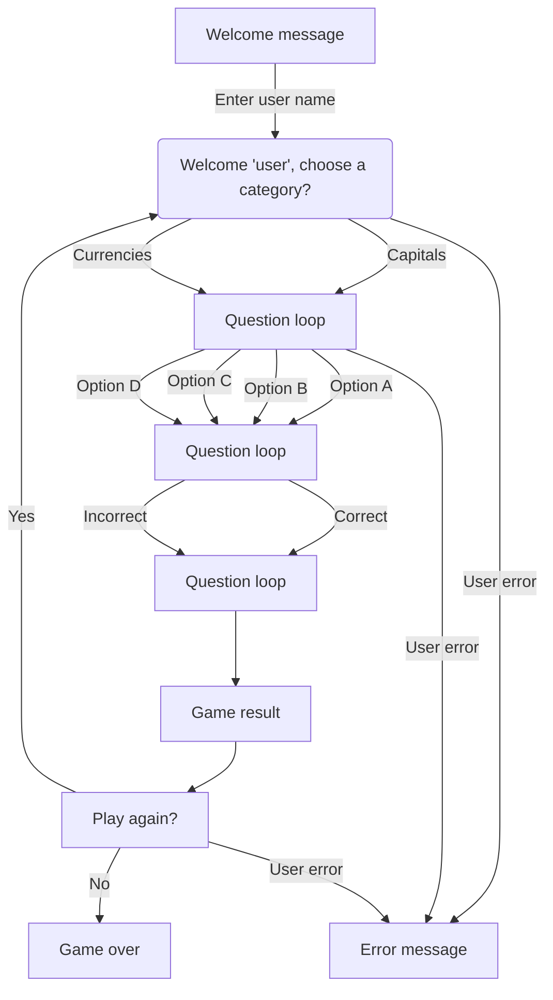
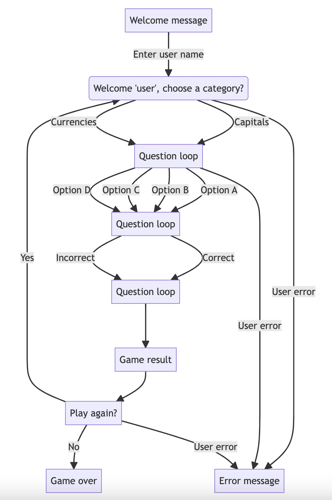

# BRAIN BOX

Welcome to Brainbox! Brainbox is a Python terminal quiz game with the theme being general knowledge. Users will answer ten questions based on world capitals or world currencies depending on their preference. Brainbox is aimed at people of all ages and may be useful to those hoping to learn a little more about world currencies and capitals. The site is very intuitive and easy to navigate.

## UX

As this site is confined to the Python terminal the design process was very straight forward. For ease of use and to enhance the user experience I utilised newline spacing where appropriate. I also used coloured text by importing Colorama. This helps to emphasise and differentiate between instructions, questions, right and wrong answers and also user input errors. 

## Features

### Existing Features

- **Introduction page**

    - The introduction page features a welcome message in bright cyan text and a prompt to the user to enter their name.

- **Category options**

    - The category options page greets the user and allows them to select one of two categories for the quiz. Different coloured text is used to differentiate the sections.

- **Question page**

    - The question page displays the question in white text with the question number and answer request both in bright cyan. The possible answer options are listed from a - d. 

- **Correct answer**

    - When the user gets an answer correct, a green 'Correct' appears along with a green checkmark. The user is then prompted to select 'Enter' to move to the next question in their own time.

- **Incorrect answer**

    - When the user gets an incorrect answer, a red 'Wrong' appears along with a red X. The correct answers is also given in bright cyan text.

- **Result page**

    - The result page displays a message stating 'Congratulations' and how many correct answers the user got out of ten. The grammar for 'answer(s)' is dynamic and changes according to the user receiving more than one correct answer. The user is then offered the chance to play the game again.

- **End of game**

    - Should the user elect not to play again, they are presented with a message thanking them for playing Brainbox in bright cyan text.

- **Error handling**

    - Should the user enter an incorrect keyboard selection, they will be presented with bright red text prompting them to select an appropriate option.

### Future Features

- Additional categories
    - I'd like to add multiple additional categories to the quiz to increase the difficulty and user experience of the game.

## Tools & Technologies Used

- [Python](https://www.python.org) used as the back-end programming language.
- [Git](https://git-scm.com) used for version control. (`git add`, `git commit`, `git push`)
- [GitHub](https://github.com) used for secure online code storage.
- [GitHub Pages](https://pages.github.com) used for hosting the deployed front-end site.
- [Gitpod](https://gitpod.io) used as a cloud-based IDE for development.
- [Heroku](https://www.heroku.com) used for hosting the deployed back-end site.

## Data Model

### Flowchart

To follow best practice, a flowchart was created for the app's logic,
and mapped out before coding began using a free version of
[Mermaid](https://mermaid.live/edit#pako:eNqNkttqwzAMhl9F-KYbtC-Qi5XmsLawI9sYI-mFcNQ0kFjBsTdK03efk3SjGaWrL4yQPv_I0r8TklMSnlgX_CU3qA28hokCd2bxOxWSS4KS6hozWsFkctNEypAGW7tLYUkN-Fc_3KjNjsYgN8w1AYJEQxnr7fS6l_Q7hQCr3GBRNxDEd1gZrlaDstWalMypA54t1SZnBQX_4d7aFkhr1g3cxlEb_Hbac0HHPVbd-1kD4Um1AeVfRAUXUeF56v_-w34e7OYhTQPRSbEeWip5HotaDObx3O0MNNW2MIfKvKss4qcCt4AZ5mp6qCw66Y92Ef5x5oEbWPZK_El6QA9-JcaiJF1injqH7VosEWZDJSXCc2FKa3R9JCJRe4eiNfyyVVJ4RlsaC1ulzj9hjpnGUnhrZxmXpTQ3rO9713bm3X8D71XnVw)

Below is the flowchart of the main process of this Python program. It shows the entire cycle of the program.

### Functions

The primary functions used on this application are:

- `welcome()`
    - Welcome message, name validation & starts quiz.
- `launch_quiz()`
    - Starts the quiz.
- `validate_name()`
    - Validate that the user's name is valid.
- `validate_category()`
    - Ensure the user is selecting a valid category.
- `loop_questions()`
    - Main function loop.
- `play_again()`
    -  Ask the user if they want to play again.
- `load_question_options()`
    -  Loads questions and returns random order.
- `show_next_question()`
    -  Calls next question and verifies right or wrong user selection.
- `get_user_selection()`
    -  Handles user input, labels options with ascii lowercase.
- `clear()`
    -  Clear function to clean-up the terminal so things don't get messy.

### Imports

I've used the following Python packages and/or external imported packages.

- `time`: used for adding time delays
- `os`: used for adding a `clear()` function
- `colorama`: used for including color in the terminal
- `random`: used to get a random choice from a list

## Testing

For all testing, please refer to the [TESTING.md](TESTING.md) file.

## Deployment

Code Institute has provided a [template](https://github.com/Code-Institute-Org/python-essentials-template) to display the terminal view of this backend application in a modern web browser.
This is to improve the accessibility of the project to others.

The live deployed application can be found deployed on [Heroku](https://brainbox-ecc27e367bd0.herokuapp.com).

### Heroku Deployment

This project uses [Heroku](https://www.heroku.com), a platform as a service (PaaS) that enables developers to build, run, and operate applications entirely in the cloud.

Deployment steps are as follows, after account setup:

- Select **New** in the top-right corner of your Heroku Dashboard, and select **Create new app** from the dropdown menu.
- Your app name must be unique, and then choose a region closest to you (EU or USA), and finally, select **Create App**.
- From the new app **Settings**, click **Reveal Config Vars**, and set the value of KEY to `PORT`, and the value to `8000` then select *add*.
- If using any confidential credentials, such as CREDS.JSON, then these should be pasted in the Config Variables as well.
- Further down, to support dependencies, select **Add Buildpack**.
- The order of the buildpacks is important, select `Python` first, then `Node.js` second. (if they are not in this order, you can drag them to rearrange them)

Heroku needs two additional files in order to deploy properly.
- requirements.txt
- Procfile

You can install this project's **requirements** (where applicable) using:
- `pip3 install -r requirements.txt`

If you have your own packages that have been installed, then the requirements file needs updated using:
- `pip3 freeze --local > requirements.txt`

The **Procfile** can be created with the following command:
- `echo web: node index.js > Procfile`

For Heroku deployment, follow these steps to connect your own GitHub repository to the newly created app:

Either:
- Select **Automatic Deployment** from the Heroku app.

Or:
- In the Terminal/CLI, connect to Heroku using this command: `heroku login -i`
- Set the remote for Heroku: `heroku git:remote -a app_name` (replace *app_name* with your app name)
- After performing the standard Git `add`, `commit`, and `push` to GitHub, you can now type:
	- `git push heroku main`

The frontend terminal should now be connected and deployed to Heroku!

### Local Deployment

This project can be cloned or forked in order to make a local copy on your own system.

For either method, you will need to install any applicable packages found within the *requirements.txt* file.
- `pip3 install -r requirements.txt`.

If using any confidential credentials, such as `CREDS.json` or `env.py` data, these will need to be manually added to your own newly created project as well.

#### Cloning

You can clone the repository by following these steps:

1. Go to the [GitHub repository](https://github.com/JamesH003/brain-box) 
2. Locate the Code button above the list of files and click it 
3. Select if you prefer to clone using HTTPS, SSH, or GitHub CLI and click the copy button to copy the URL to your clipboard
4. Open Git Bash or Terminal
5. Change the current working directory to the one where you want the cloned directory
6. In your IDE Terminal, type the following command to clone my repository:
	- `git clone https://github.com/JamesH003/brain-box.git`
7. Press Enter to create your local clone.

Alternatively, if using Gitpod, you can click below to create your own workspace using this repository.

Please note that in order to directly open the project in Gitpod, you need to have the browser extension installed.
A tutorial on how to do that can be found [here](https://www.gitpod.io/docs/configure/user-settings/browser-extension).

#### Forking

By forking the GitHub Repository, we make a copy of the original repository on our GitHub account to view and/or make changes without affecting the original owner's repository.
You can fork this repository by using the following steps:

1. Log in to GitHub and locate the [GitHub Repository](https://github.com/JamesH003/brain-box)
2. At the top of the Repository (not top of page) just above the "Settings" Button on the menu, locate the "Fork" Button.
3. Once clicked, you should now have a copy of the original repository in your own GitHub account!

### Local VS Deployment

<!-- ⚠️⚠️⚠️⚠️⚠️ START OF NOTES (to be deleted) ⚠️⚠️⚠️⚠️⚠️

Use this space to discuss any differences between the local version you've developed, and the live deployment site on Heroku.

🛑🛑🛑🛑🛑 END OF NOTES (to be deleted) 🛑🛑🛑🛑🛑 -->

## Credits

### Content

| Source | Location | Notes |
| --- | --- | --- |
| [Markdown Builder](https://traveltimn.github.io/markdown-builder) | README and TESTING | tool to help generate the Markdown files |
| [geeksforgeeks](https://www.geeksforgeeks.org/python-string-ascii_lowercase/) | question options | lowercase letters |
| [Real Python](https://realpython.com/python-enumerate/) | quiz page | add counter to iterable |
| [W3schools](https://www.w3schools.com/python/ref_func_min.asp) | quiz page | min function |
| [W3schools](https://www.w3schools.com/python/ref_random_choices.asp) | quiz page | random choice method |
| [W3schools](https://www.w3schools.com/python/ref_random_sample.asp) | quiz page | random sample method |
| [Ask Python](https://www.askpython.com/python/examples/plus-equal-operator) | quiz page | the += operator |
| [Stack Overflow](https://stackoverflow.com/questions/2084508/clear-terminal-in-python) | entire site | clear the terminal |
| [Real Python](https://realpython.com/python-sleep/) | enitre site | time delay for text |
| [Youtube](https://www.youtube.com/watch?v=u51Zjlnui4Y) | entire site | use of colorama on terminal |
| [Real Python](https://realpython.com/python-quiz-application/#step-3-organize-your-code-with-functions) | entire site | python quiz tutorial |

### Media

| Source | Location | Type | Notes |
| --- | --- | --- | --- |
| [Emojipedia](https://emojipedia.org/search/?q=flags) | quiz page | emojis | flags in questions and right and wrong emojis |
| [Britannica](https://www.britannica.com/quiz/capital-cities-of-the-world-quiz) | quiz page | content | capitals question content |
| [Jetpunk](https://www.jetpunk.com/quizzes/name-currency) | quiz page | content | currencies question content |

### Acknowledgements

- I would like to thank my Code Institute mentor, [Tim Nelson](https://github.com/TravelTimN) for their support throughout the development of this project.
- I would like to thank the [Code Institute Slack community](https://code-institute-room.slack.com) for the moral support; it kept me going during periods of self doubt and imposter syndrome.
- I would like to thank my partner Caoimhe, for her continued support throughout this course.
